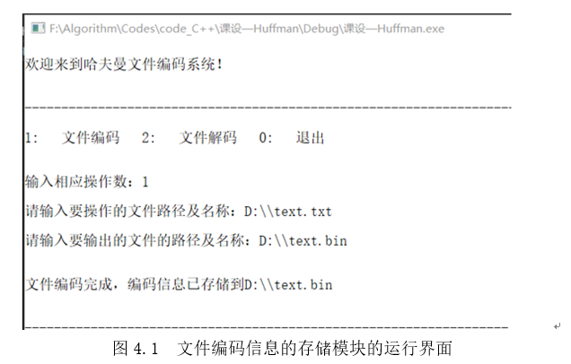

## 数据结构课程设计——Huffman树编码解码

@(C++)[Huffman |  数据结构]

---
###  1. 功能实现

 - 根据要编码的文件中字符出现的频率生成对应的哈夫曼编码；
 -  得到采用哈夫曼编码后的目标文件，并保存；
 -  根据要解码的文件对应的哈夫曼码表对文件进行解码；
 -  得到解码后的目标文件并保存；

### 2. 系统模块结构图
 

 > 　　如上图所示，该哈夫曼树解码编码系统主要分为文件编码与文件解码两大模块，其各自又有三小模块。
　　对于文件编码模块，当程序得到从键盘输入的待编码的文件的路径后，先对整个编码文件进行扫描，得到文件的大小及出现的字符种类数，生成字符频数表，并将这些信息存入指定的文件中。接着，根据字符种类数和字符频率表，动态开辟相应数组空间，构建对应的哈夫曼树，再依次从树的叶子结点开始向树根上溯，得到编码表；最后，再对编码文件进行二次扫描，对照编码表，找到文件中各字符对应的二进制编码并存入到指定文件中，完成文件的编码与存储。
　　而对于文件解码模块，其实现流程与文件编码模块类似。即先读取待解码文件里首部的关于编码文件的信息，生成字符频数表，再建立哈夫曼树，最后扫描待解码文件里字符编码信息，在哈夫曼树中从树根向下检索，直到达叶子结点，得到编码对应的字符，将此字符存入指定的文件中，完成文件的解码与存储。

### 3.  代码结构图

>　　程序的主体为HuffmanFileCode类，在Huffman.h头文件中定义了相关结构体和HuffmanFileCode类。在Huffman.cpp文件中详细实现了相关类函数。main.cpp为程序的入口，调用了HuffmanFileCode类的menu函数。

### 4. 程序运行结果

